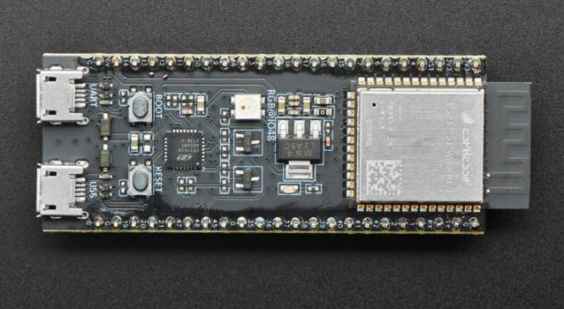

# OGX-Wireless-Lite

Firmware for the ESP32-S3 that allows you to use your Bluetooth LE gamepads on several different game consoles.

### Supported platforms
- Original Xbox
- XInput
- PlayStation 3
- PlayStation Classic
- Nintnendo Switch

### Supported gamepads
- Xbox One (Bluetooth version)
- Xbox Series
- Xbox Elite 2
- Steam
- Stadia
- Generic BLE HID gamepads should work as well

## Changing input mode
By default the input mode is set to OG Xbox, you must hold a button combo for 3 seconds to change which platform you want to play on. Your chosen input mode will persist after powering off the device. 

### XInput
Start + Dpad Up 
### Original Xbox
Start + Dpad Right
### Switch
Start + Dpad Down
### PlayStation 3
Start + Dpad Left
### PlayStation Classic
Start + A

After a new mode is stored, the device will reset itself so you don't need to unplug it. 

## Hardware
You can use either the official ESP32-S3 DevKit C, DevKit M, or the USB C clone that's widely available.

## Web app
Use this web app to change button mappings, deadzone values, and joystick inversion: https://wiredopposite.github.io/OGX-Wireless-WebApp/

You can store up to 8 different profiles. The device will require a reboot for new settings to take effect and the last profile saved will be the one that's active.
